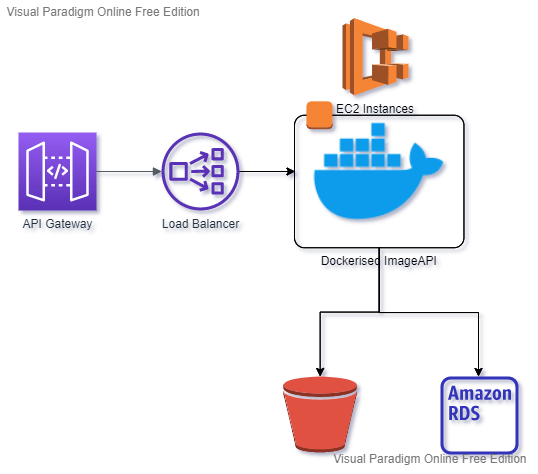

# Falcon ImageAPI

A basic Image processing API built in Falcon.

## Installation

After pulling the repository, set up your virtual environment with either `venv` or `conda`. My personal preference for package management is `conda`, and recommend it for this task.

```bash
python3.9 -m venv imageapi
```

```bash
conda create -n imageapi python=3.9.7
```

Then install dependencies with the `requirements.txt` and `pip`

```bash
pip install -r requirements.txt
```

## Running the application

We can then run the application by calling the module.

```bash
python -m imageapi
```

## Configuration

The configuration for the app is stored in `imageapi/config.yml`. If you want to change the port or host, that can be done here, as well as database name, image output location, secret keys and cookie expiry.

The default host and port is `localhost:8000`

## Usage

The `/api/user/register`, `/api/user/login` and `/api/apidoc/swagger` endpoints are unsecured. To inspect API schema head to [Viewing Swagger (OpenAPI) Specification](#viewing-swagger-specification)

To interact with the other endpoints, as user must first `/api/user/register` then
`/api/user/login`. This will set a cookie allowing access to the backend.

## Viewing Swagger Specification

I decided to use spectree to document the API. Once the server is running, you can access and interact with the API at the `host:port/apidoc/swagger` specified in the `config.yml`.

Unfortunately not all datatypes/data structures are available through `pydantic`. Largely the documentation is correct, however the `POST host:port/api/images` does not properly describe how to interact with the endpoint, or describe the return payload of `GET host:port/api/image/{img_id}`.

To interact with `POST host:port/api/images` and `GET host:port/api/image/{img_id}` the requests should look like this (example in tests also):

```python
from requests import Session
import json

host = "localhost"
port = 8000

session = Session()

# Login
session.post(
    "http://localhost:8000/api/user/login",
    data={
        "email": f"some_valid_email@annalise.ai",
        "password": "some_valid_password"
    },
)

# Post request
files = [
    ("image", ("image_name.png", b"image_bytes_data", "image/png")),
    ("tags", (None, json.dumps(["tags",]), "application/json"))
]

post_response = session.post(
    f"http://{host}:{port}/api/images",
    files=files,
)

# Get request
get_response = session.get(
    f"http://{host}:{port}/api/image/{post_response.json()['img_id']}",
)
```


## Design Approach

I have approached this challenge trying to follow REST API best practices. For example, I made resources nouns, collections plurals, and query parameters are filters on collections. I've tried to use the appropriate HTTP codes where possible, and provided documentation for each of the endpoints. Endpoints are nested, (e.g. `/api/{img_id}/tags`) to illustrate relationships.

The application itself has no state, and there are abstractions that allow for deployment to a cloud environment. For example, the [ImageHandler](https://github.com/KhanMechAI/annalise-ai/blob/b3ca163586bce6b9647259f8bf0d0f15e4c60165/imageapi/utils.py#L16)
class can be modifed to use an S3 bucket instead of the local file system, providing a consistent interface to the rest of the application. 

Images are stored on the local file system with uuid's that kept in the database to ensure there are no conflicts. The database stores the locations of the images and all other related data, i.e. tags, users and associations between them.

Resources I have referred to during this challenged and in the past:

[RESTful web API design](https://docs.microsoft.com/en-us/azure/architecture/best-practices/api-design)

[REST API Best Practices](https://www.freecodecamp.org/news/rest-api-best-practices-rest-endpoint-design-examples/)

[OpenAPI Specification](https://spec.openapis.org/oas/v3.1.0)

## Deployment and Roadmap

### Deployment

An ideal deployment would be to:
1. change deployment server config to use NGINX and WSGI as suggested in the [Falcon documentation](https://falcon.readthedocs.io/en/stable/)
2. containerise the application using Docker
3. host the container on an AWS EC2 instance
4. re-implement authentication and user-management using AWS Cognito
5. implement the AWS API Gateway to manage external API calls
6. insert a load balancer between the gateway and the instance
7. migrate the image storage to AWS S3
8. migrate the database to AWS RDS
9. implement a CI/CD pipeline with AWS CodeDeploy, potentially a Red Light Green Light deployment (or even better, to have the full stack managed with CloudFormation) to manage downtime.



### Roadmap

So what did I miss? 
* User Tracking. I would liked to have implemented the usage tracking, though if it is being deployed to the cloud AWS API Gateway does usage logging adn is probably more appropriate than my possible implementation.
* Complete and accurate Swagger/OpenAPI/OAS documentation. Not for lack of trying, but I could not figure out how to properly document the  `POST host:port/api/images`
  and `GET host:port/api/image/{img_id}` endpoints using `spectree`/`pydantic`. Given a bit more time, I'm sure I could've got it there, but I decided to cut my losses.
* GitHub Actions. It was in my initial plan to write some actions to run the testing but I just ran short of time, unfortunately.
* More complete test suite. I would build this out to cover many, many more test cases.
* Versioning. I had an oversight w.r.t versioning the API. I would modify my implementation to include a `/v<x>/` in the path. 

## Contribution

IF you'd like to contribute, feel free to rais a PR or fork me!

Cheers,

Khan


